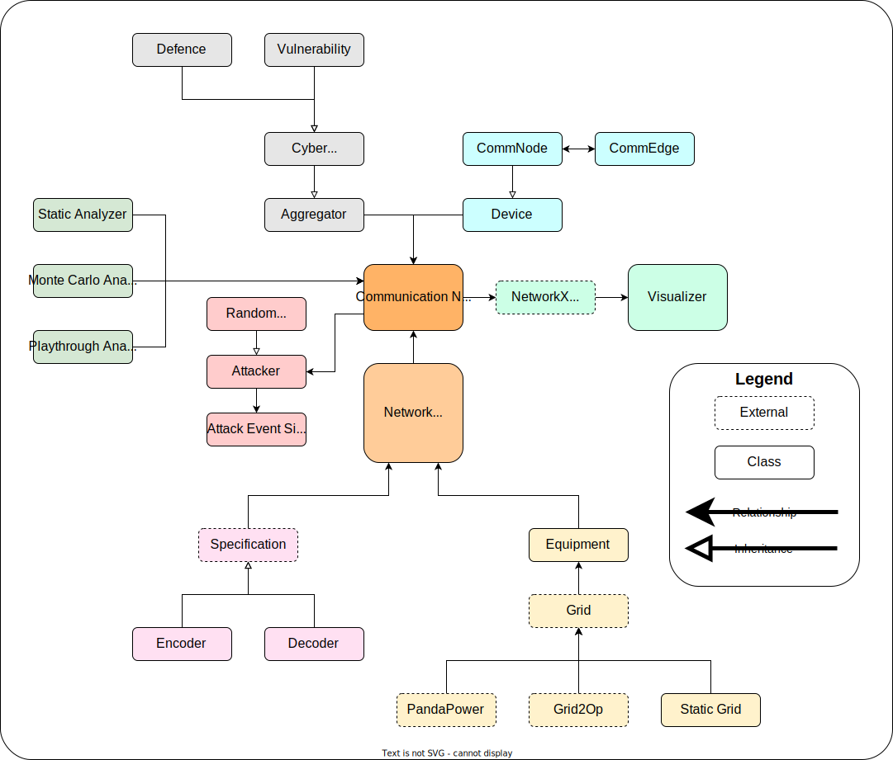

# Threats2Power

Threats2Power provides a high-level, abstract, representation of the communication network for power systems.

Features include:

* Procedural generation of communication network topologies
* Association of communication network sensors / actuators with PandaPower and Grid2Op components
* Static analysis of small communication networks
* Monte Carlo analysis of any communication network
* Event-like simulation of cyber attacks over a period of time
* Visualization of the communication network topology, including which components have been compromised

## Module Layout

A rough outline of this module is shown below:

